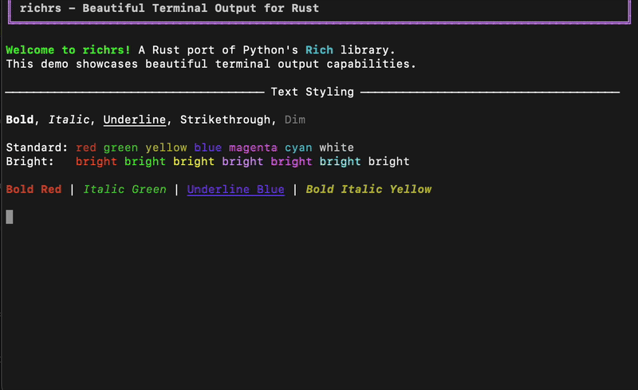
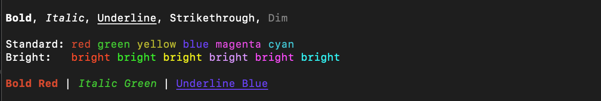
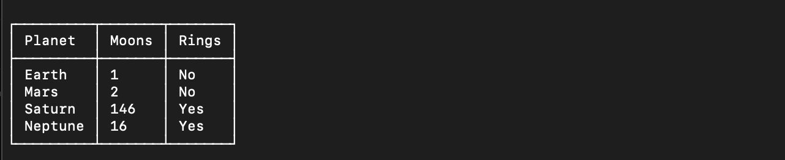
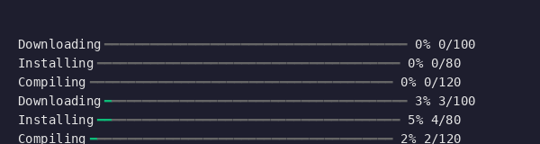
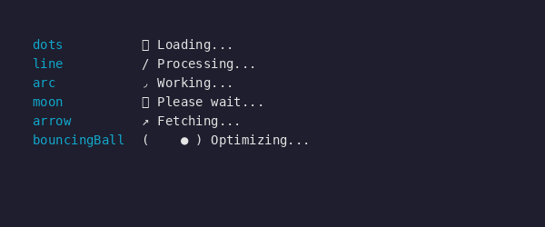

# richrs

A Rust port of the [Rich](https://github.com/Textualize/rich) Python library for beautiful terminal output.

[](https://crates.io/crates/richrs)
[](https://docs.rs/richrs)
[](https://opensource.org/licenses/MIT)
[](https://www.rust-lang.org)
[](https://codecov.io/gh/olirice/richrs)

<p align="center">
  
</p>

## Overview

**richrs** brings the power of Python's Rich library to Rust, providing beautiful terminal output with colors, styles, tables, progress bars, and more. The API is designed to feel Rust-native while providing compatible markup syntax and styling.

```rust
use richrs::prelude::*;

fn main() -> Result<()> {
    let mut console = Console::new();
    console.print("[bold red]Hello[/] [green]World![/]")?;
    Ok(())
}
```

## Features

| Feature | Description |
|---------|-------------|
| **Console** | Main interface for terminal output with markup support |
| **Style** | Text styles with colors and attributes (bold, italic, underline, etc.) |
| **Color** | Full color support: ANSI 16 colors and 256-color palette |
| **Text** | Rich text objects with inline styling and spans |
| **Markup** | BBCode-like syntax: `[bold red]text[/]` |
| **Panel** | Boxed content with titles, subtitles, and multiple border styles |
| **Table** | Data tables with borders, alignment, and styling |
| **Tree** | Hierarchical data visualization with guides |
| **Rule** | Horizontal dividers with optional centered titles |
| **Progress** | Progress bars with multiple concurrent tasks |
| **Spinner** | 45+ animated loading indicators |
| **Status** | Spinner with status message for long-running operations |
| **Prompt** | User input with validation (text, confirm, int, float) |
| **Columns** | Multi-column layout for content |
| **Live** | Real-time content updates in place |
| **Syntax** | Syntax highlighting for 100+ languages (optional feature) |
| **Markdown** | Markdown rendering (optional feature) |
| **Pretty** | Pretty-printing for data structures |
| **Highlighter** | Automatic pattern highlighting (URLs, numbers, UUIDs, etc.) |
| **Emoji** | 670+ emoji name-to-character mappings |

## Installation

Add to your `Cargo.toml`:

```toml
[dependencies]
richrs = "0.1"
```

### Optional Features

```toml
[dependencies]
richrs = { version = "0.1", features = ["syntax", "markdown"] }
```

| Feature | Description | Dependencies |
|---------|-------------|--------------|
| `syntax` | Syntax highlighting for code | `syntect` |
| `markdown` | Markdown rendering | `pulldown-cmark` |
| `full` | Enable all optional features | - |

## Quick Start

### Text Styling

```rust
use richrs::prelude::*;

fn main() -> Result<()> {
    let mut console = Console::new();

    // Print with markup
    console.print("[bold magenta]Welcome[/] to [italic cyan]richrs[/]!")?;

    // Print styled text
    console.print("[bold red]Error:[/] Something went wrong")?;

    Ok(())
}
```



### Panels

```rust
use richrs::prelude::*;

fn main() -> Result<()> {
    let mut console = Console::new();

    let panel = Panel::new("Hello from richrs!")
        .title("Greeting")
        .subtitle("A Rust port of Rich");

    console.write_segments(&panel.render(60))?;
    Ok(())
}
```


### Tables

```rust
use richrs::prelude::*;

fn main() -> Result<()> {
    let mut console = Console::new();

    let mut table = Table::new();
    table.add_column(Column::new("Planet"));
    table.add_column(Column::new("Moons"));
    table.add_column(Column::new("Rings"));

    table.add_row_cells(["Earth", "1", "No"]);
    table.add_row_cells(["Mars", "2", "No"]);
    table.add_row_cells(["Saturn", "146", "Yes"]);

    console.write_segments(&table.render(50))?;
    Ok(())
}
```



### Trees

```rust
use richrs::prelude::*;

fn main() -> Result<()> {
    let mut console = Console::new();

    let mut tree = Tree::new("project");
    tree.add(
        TreeNode::new("src")
            .with_child(TreeNode::new("main.rs"))
            .with_child(TreeNode::new("lib.rs")),
    );
    tree.add(TreeNode::new("Cargo.toml"));

    console.write_segments(&tree.render())?;
    Ok(())
}
```


### Progress Bars

```rust
use richrs::prelude::*;

fn main() -> Result<()> {
    let mut progress = Progress::new();
    let task = progress.add_task("Downloading", Some(100), true);

    for _ in 0..100 {
        progress.advance(task, 1)?;
        std::thread::sleep(std::time::Duration::from_millis(20));
    }

    Ok(())
}
```



### Spinners

```rust
use richrs::prelude::*;
use std::thread;
use std::time::Duration;

fn main() -> Result<()> {
    let mut spinner = Spinner::new("dots")?;

    for _ in 0..50 {
        print!("\r{} Loading...", spinner.next_frame());
        thread::sleep(Duration::from_millis(80));
    }

    println!("\rDone!          ");
    Ok(())
}
```



### Status (Spinner with Message)

```rust
use richrs::prelude::*;
use std::time::Duration;

fn main() -> Result<()> {
    let status = Status::new("Processing data...", "dots")?;

    status.run(Duration::from_secs(3), || {
        // Your long-running operation here
    })?;

    Ok(())
}
```

### Prompts

```rust
use richrs::prelude::*;

fn main() -> Result<()> {
    // Text prompt
    let name = Prompt::new("What is your name?").ask()?;

    // Confirmation
    let proceed = Confirm::new("Continue?").default(true).ask()?;

    // Integer with validation
    let age = IntPrompt::new("Enter your age")
        .min(0)
        .max(150)
        .ask()?;

    Ok(())
}
```

### Syntax Highlighting

Requires the `syntax` feature.

```rust
use richrs::prelude::*;

fn main() -> Result<()> {
    let mut console = Console::new();

    let code = r#"
fn main() {
    println!("Hello, world!");
}
"#;

    let syntax = Syntax::new(code, "rust")
        .line_numbers(true)
        .theme("base16-ocean.dark");

    console.write_segments(&syntax.render(80))?;
    Ok(())
}
```

### Markdown

Requires the `markdown` feature.

```rust
use richrs::prelude::*;

fn main() -> Result<()> {
    let mut console = Console::new();

    let md = "# Hello\n\nThis is **bold** and *italic* text.";
    let markdown = Markdown::new(md);

    console.write_segments(&markdown.render(80))?;
    Ok(())
}
```

### Live Display

```rust
use richrs::prelude::*;
use std::time::Duration;

fn main() -> Result<()> {
    let mut live = Live::new();

    for i in 0..10 {
        live.update(&format!("Count: {}", i))?;
        std::thread::sleep(Duration::from_millis(500));
    }

    Ok(())
}
```

### Pretty Printing

```rust
use richrs::prelude::*;
use std::collections::HashMap;

fn main() {
    let mut data = HashMap::new();
    data.insert("name", "Alice");
    data.insert("role", "Developer");

    // Pretty print any Debug type
    let output = inspect(&data);
    eprintln!("{}", output);
}
```

Output:
```
{
    "name": "Alice",
    "role": "Developer",
}
```

## Style Reference

### Text Attributes

| Attribute | Description |
|-----------|-------------|
| `bold` | Bold text |
| `italic` | Italic text |
| `underline` | Underlined text |
| `strike` | Strikethrough |
| `dim` | Dimmed text |
| `reverse` | Swap foreground/background |
| `blink` | Blinking text |
| `conceal` | Hidden text |

### Colors

**Standard colors:** `black`, `red`, `green`, `yellow`, `blue`, `magenta`, `cyan`, `white`

**Bright variants:** `bright_red`, `bright_green`, `bright_blue`, etc.

**256-color palette:** `color(196)`

## Demo

Run the interactive demo to see all features in action:

```bash
git clone https://github.com/olirice/richrs
cd richrs
cargo run --release
```

## Minimum Supported Rust Version

richrs requires **Rust 1.85** or later.

## Dependencies

### Required
- `crossterm` - Terminal capabilities
- `unicode-width` - Unicode text width calculation
- `unicode-segmentation` - Unicode grapheme handling
- `thiserror` - Error handling
- `regex` - Markup and pattern parsing
- `once_cell` - Lazy initialization

### Optional
- `syntect` - Syntax highlighting (feature: `syntax`)
- `pulldown-cmark` - Markdown parsing (feature: `markdown`)

## License

MIT License - see [LICENSE](LICENSE) for details.

## Acknowledgments

- [Textualize](https://github.com/Textualize) for the original [Rich](https://github.com/Textualize/rich) library
- The Rust community for excellent terminal libraries
